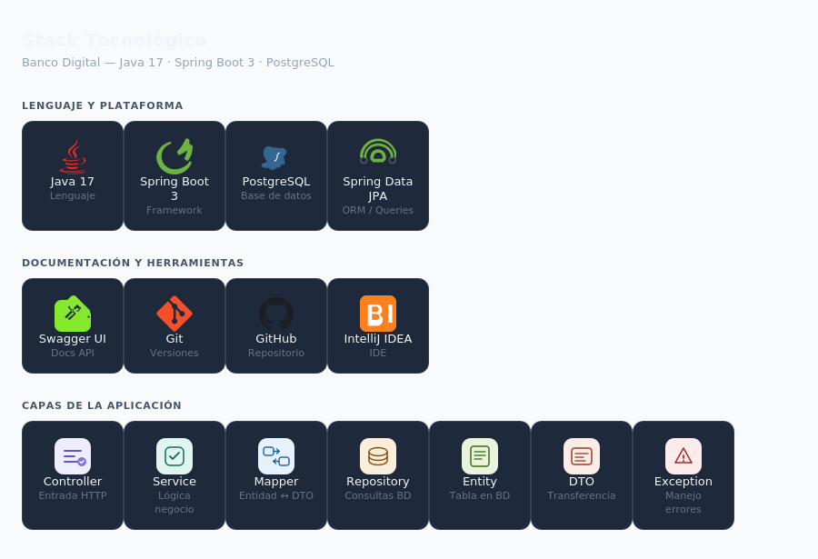
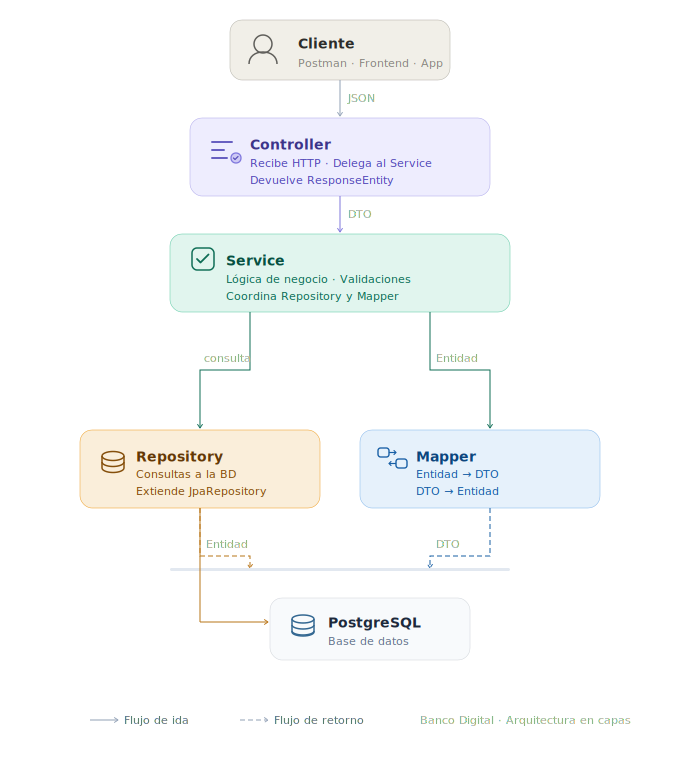
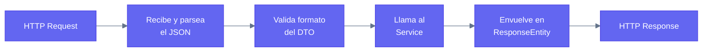
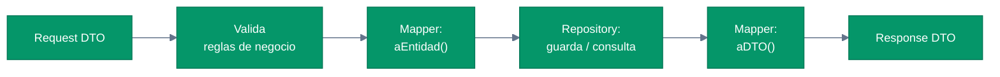
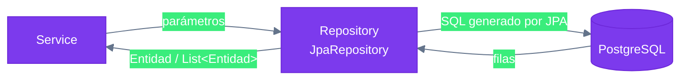
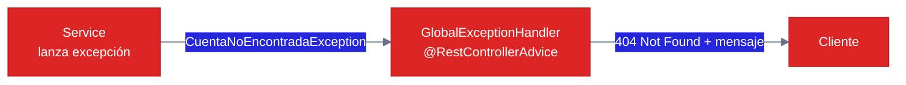
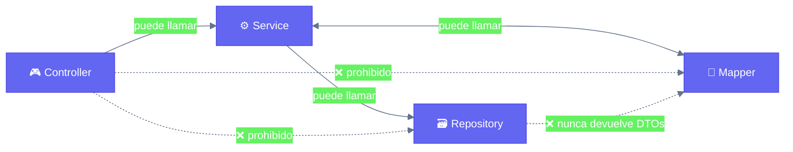

# 🏛️ Arquitectura del Sistema — Banco Digital

> **Proyecto:** Banco Digital
> **Stack:** Java 17 · Spring Boot 3 · PostgreSQL
> **Patrón:** Arquitectura en capas (Layered Architecture)

> 📋 Para las reglas de trabajo del equipo, consulta [`metodologia.md`](./metodologia.md)

---

## Stack tecnológico


---

## Visión general — arquitectura en capas

La aplicación sigue el patrón **Layered Architecture**. Cada capa tiene una única responsabilidad y solo puede comunicarse con la capa inmediatamente adyacente. Saltarse una capa está prohibido.

## Flujo de capas



## Capas — detalle de responsabilidades

### 🎮 Controller — capa de entrada

**Propósito:** ser la puerta de entrada de la aplicación. Recibe la petición HTTP, la transforma en un DTO y la delega al Service. No toma ninguna decisión de negocio.

**Reglas:**
- Solo habla con el Service, nunca con el Repository ni con el Mapper directamente.
- Siempre devuelve `ResponseEntity`.
- Siempre documenta sus endpoints con anotaciones Swagger.



---

### ⚙️ Service — capa de negocio

**Propósito:** contener toda la lógica del negocio. Es el cerebro de la aplicación. Valida reglas, coordina entre Repository y Mapper, y toma todas las decisiones importantes.

**Reglas:**
- Es el **único lugar** donde se inyecta y usa el Mapper.
- Siempre se define como **interfaz + implementación** separadas.
- No construye DTOs ni los mapea directamente — delega eso al Mapper.



---

### 🔄 Mapper — capa de conversión

**Propósito:** convertir entre entidades y DTOs. Es la única clase autorizada para hacer esta transformación. Su existencia protege al cliente de ver datos internos de la base de datos.

**Reglas:**
- Cada entidad tiene exactamente un Mapper.
- El método entidad → DTO siempre se llama `aDTO`.
- El método DTO → entidad siempre se llama `aEntidad`.
- Se anota con `@Component`.

**¿Por qué es obligatorio el Mapper?**

Si el Controller devolviera la entidad directamente, el cliente vería todo: contraseñas hasheadas, campos de auditoría, ids internos, relaciones. El Mapper actúa como filtro — solo sale lo que el equipo decide explícitamente que puede salir.

---

### 🗃️ Repository — capa de persistencia

**Propósito:** gestionar el acceso a la base de datos. Habla SQL (a través de JPA) y devuelve entidades. No sabe nada de DTOs ni de lógica de negocio.

**Reglas:**
- Extiende `JpaRepository` — Spring genera automáticamente los métodos básicos (findById, save, delete, findAll).
- Devuelve siempre entidades, nunca DTOs.
- Solo recibe parámetros primitivos o entidades, nunca DTOs.



---

### 📦 Entity — modelo de datos

**Propósito:** representar una tabla de la base de datos como una clase Java. Cada campo es una columna. Es el objeto que JPA persiste y recupera.

**Reglas:**
- Se anota con `@Entity` y `@Table(name = "...")`.
- Siempre usa `@Column(name = "...")` en cada campo, incluso si el nombre coincide.
- Nunca sale del Repository — el Mapper la convierte antes de llegar al Controller.

---

### ⚠️ Exception — manejo de errores

**Propósito:** centralizar el manejo de errores. Todas las excepciones del negocio se lanzan desde el Service y se capturan en `GlobalExceptionHandler`, que devuelve una respuesta HTTP coherente al cliente.

**Reglas:**
- No usar try-catch en controllers ni services salvo casos muy específicos.
- Cada error de negocio tiene su propia excepción.
- El `GlobalExceptionHandler` mapea cada excepción a un código HTTP.



---

## Reglas de comunicación entre capas



| Desde | Puede llamar a | No puede llamar a |
|---|---|---|
| **Controller** | Service | Repository, Mapper, Entity |
| **Service** | Repository, Mapper | — |
| **Repository** | PostgreSQL (vía JPA) | Service, Mapper, DTO |
| **Mapper** | — (no depende de nadie) | Repository, Service |

---

## Estructura de carpetas

```
src/main/java/fe/banco_digital/
│
├── controller/               ← 🎮 Capa de entrada
│   └── CuentaController.java
│
├── service/                  ← ⚙️ Capa de negocio
│   ├── CuentaService.java         (interfaz)
│   └── CuentaServiceImpl.java     (implementación)
│
├── mapper/                   ← 🔄 Capa de conversión
│   └── CuentaMapper.java
│
├── repository/               ← 🗃️ Capa de persistencia
│   └── CuentaRepository.java
│
├── entity/                   ← 📦 Modelo de datos
│   └── Cuenta.java
│
├── dto/                      ← 📨 Objetos de transferencia
│   ├── CuentaDTO.java             (response)
│   └── CrearCuentaDTO.java        (request)
│
├── exception/                ← ⚠️ Manejo de errores
│   ├── CuentaNoEncontradaException.java
│   └── GlobalExceptionHandler.java
│
└── web/
    └── BancoDigitalApplication.java
```

---

*Este documento describe el diseño del sistema. Las reglas de trabajo del equipo están en [`metodologia.md`](./metodologia.md).*
