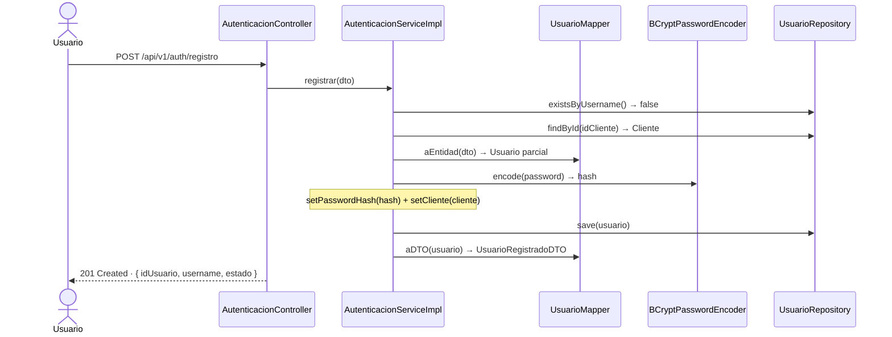
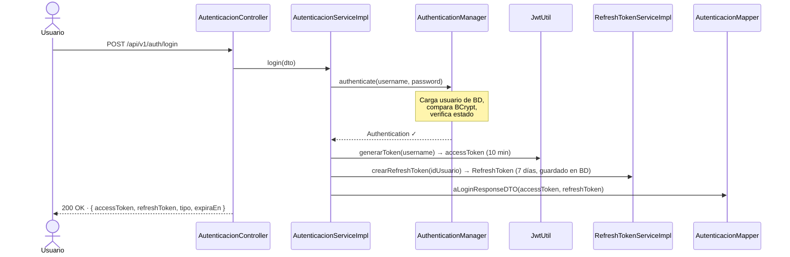
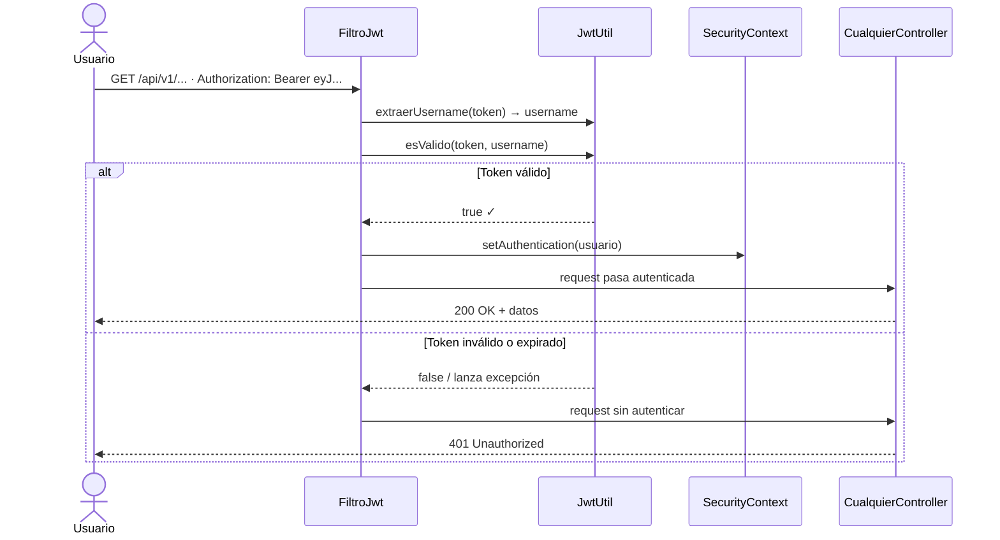
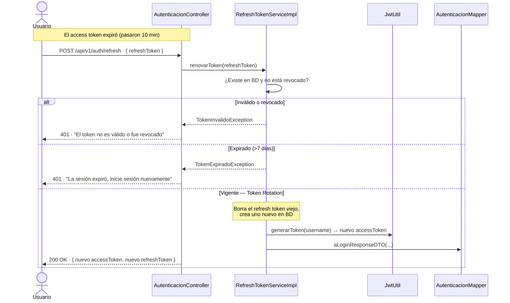
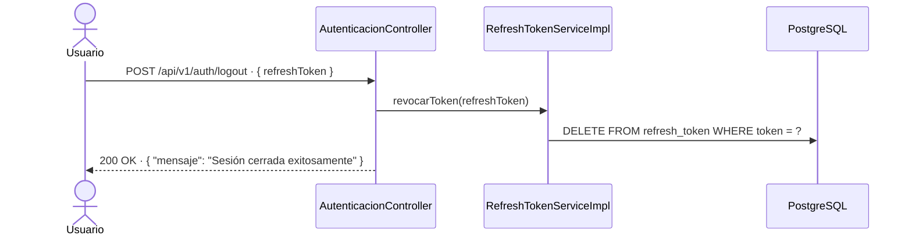

# Autenticación — JWT + Refresh Token
> **Banco Digital** · Implementado en rama `autentication/mista`

---

## Estrategia de tokens

```
┌──────────────────────┬──────────────────────────────────┐
│   ACCESS TOKEN       │   REFRESH TOKEN                  │
├──────────────────────┼──────────────────────────────────┤
│  Duración: 10 min    │  Duración: 7 días                │
│  Tipo: JWT firmado   │  Tipo: UUID opaco                │
│  Vive: solo cliente  │  Vive: BD + cliente              │
│  Stateless           │  Stateful (guardado en BD)       │
│  Para: acceder APIs  │  Para: renovar el access token   │
└──────────────────────┴──────────────────────────────────┘
```

| Escenario | Solo Access Token largo | Dual Token |
|---|---|---|
| Token robado | Atacante tiene acceso por horas | Ventana máxima de 10 minutos |
| Re-login del usuario | Obligatorio al expirar | No necesario (usa refresh) |
| Revocar acceso | Imposible sin blacklist | Borrar refresh token de BD |

---

## Estructura de archivos

```
src/main/java/fe/banco_digital/
│
├── security/
│   ├── JwtUtil.java                   → Genera y valida access tokens JWT
│   ├── FiltroJwt.java                 → Intercepta cada request y valida el token
│   ├── UsuarioDetallesService.java    → Adapta Usuario → UserDetails de Spring
│   └── ConfiguracionSeguridad.java    → Rutas públicas/protegidas y cadena de filtros
│
├── controller/
│   └── AutenticacionController.java   → /registro, /login, /refresh, /logout
│
├── service/
│   ├── AutenticacionService.java      → Interfaz
│   ├── AutenticacionServiceImpl.java  → Login y registro
│   ├── RefreshTokenService.java       → Interfaz
│   └── RefreshTokenServiceImpl.java   → Crear, rotar y revocar refresh tokens
│
├── mapper/
│   ├── UsuarioMapper.java             → RegistroRequestDTO ↔ Usuario, Usuario → UsuarioRegistradoDTO
│   └── AutenticacionMapper.java       → Arma el LoginResponseDTO
│
├── repository/
│   └── RefreshTokenRepository.java    → Acceso a la tabla refresh_token
│
├── entity/
│   └── RefreshToken.java              → Nueva entidad JPA
│
├── dto/
│   ├── LoginRequestDTO.java           → { username, password }
│   ├── LoginResponseDTO.java          → { accessToken, refreshToken, tipo, expiraEn }
│   ├── RegistroRequestDTO.java        → { username, password, idCliente }
│   ├── UsuarioRegistradoDTO.java      → { idUsuario, username, estado }
│   └── RefreshTokenRequestDTO.java    → { refreshToken }
│
└── exception/
    ├── CredencialesInvalidasException.java
    ├── UsuarioYaExisteException.java
    ├── TokenInvalidoException.java
    └── TokenExpiradoException.java
```

**Archivos modificados:**
- `pom.xml` → Spring Security + JJWT 0.12.6
- `GlobalExceptionHandler.java` → 4 nuevos handlers de auth
- `application.properties` → `jwt.secreto`, `jwt.expiracion-access-ms`, `jwt.expiracion-refresh-dias`
- `UsuarioRepository.java` → `existsByUsername()`

---

## Flujo 1 — Registro



---

## Flujo 2 — Login



---

## Flujo 3 — Request protegida



---

## Flujo 4 — Refresh Token



---

## Flujo 5 — Logout


