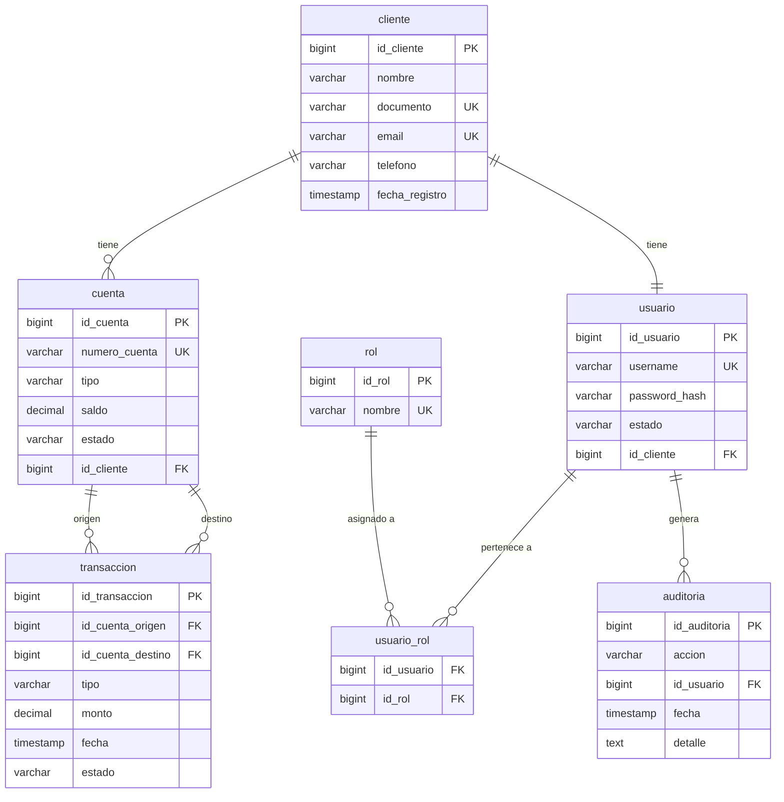

# 🗄️ Modelo de Base de Datos — Banco Digital

> Este documento describe el modelo lógico de la base de datos del sistema.  
> **Convención:** Todos los nombres de tablas, columnas, entidades JPA y variables de código están en **español**.

---

## Diagrama Entidad-Relación



---

## Relaciones del Modelo

| Relación | Cardinalidad | Descripción |
|---|---|---|
| `cliente` → `cuenta` | 1 a N | Un cliente puede tener múltiples cuentas |
| `cliente` → `usuario` | 1 a 1 | Cada cliente tiene exactamente un usuario de acceso |
| `usuario` → `usuario_rol` | 1 a N | Un usuario puede tener múltiples roles |
| `rol` → `usuario_rol` | 1 a N | Un rol puede estar asignado a múltiples usuarios |
| `cuenta` → `transaccion` (origen) | 1 a N | Una cuenta puede ser origen de múltiples transacciones |
| `cuenta` → `transaccion` (destino) | 1 a N | Una cuenta puede ser destino de múltiples transacciones |
| `usuario` → `auditoria` | 1 a N | Un usuario puede generar múltiples registros de auditoría |

> `usuario_rol` es una tabla intermedia que resuelve la relación N:M entre `usuario` y `rol`.  
> Su PK compuesta `(id_usuario, id_rol)` garantiza que no existan duplicados.

---

## Descripción de Tablas

### `cliente`
Almacena la información personal de los clientes del banco.

| Columna | Tipo | Restricciones | Descripción |
|---|---|---|---|
| `id_cliente` | `BIGINT` | PK, AUTO_INCREMENT | Identificador único del cliente |
| `nombre` | `VARCHAR(150)` | NOT NULL | Nombre completo del cliente |
| `documento` | `VARCHAR(20)` | NOT NULL, UNIQUE | Número de documento de identidad |
| `email` | `VARCHAR(100)` | NOT NULL, UNIQUE | Correo electrónico de contacto |
| `telefono` | `VARCHAR(20)` | NULLABLE | Teléfono de contacto |
| `fecha_registro` | `TIMESTAMP` | DEFAULT NOW() | Fecha y hora de registro en el sistema |

---

### `usuario`
Gestiona las credenciales de acceso al sistema. Cada usuario está ligado a exactamente un cliente.

| Columna | Tipo | Restricciones | Descripción |
|---|---|---|---|
| `id_usuario` | `BIGINT` | PK, AUTO_INCREMENT | Identificador único del usuario |
| `username` | `VARCHAR(50)` | NOT NULL, UNIQUE | Nombre de usuario para login |
| `password_hash` | `VARCHAR(255)` | NOT NULL | Contraseña encriptada con BCrypt |
| `estado` | `VARCHAR(20)` | NOT NULL | Estado del usuario: `ACTIVO`, `BLOQUEADO` |
| `id_cliente` | `BIGINT` | FK → `cliente`, NOT NULL, UNIQUE | Cliente asociado |

---

### `rol`
Catálogo de roles disponibles en el sistema (ej: `ADMIN`, `CLIENTE`, `CAJERO`).

| Columna | Tipo | Restricciones | Descripción |
|---|---|---|---|
| `id_rol` | `BIGINT` | PK, AUTO_INCREMENT | Identificador único del rol |
| `nombre` | `VARCHAR(50)` | NOT NULL, UNIQUE | Nombre del rol |

---

### `usuario_rol`
Tabla intermedia que representa la relación N:M entre `usuario` y `rol`.

| Columna | Tipo | Restricciones | Descripción |
|---|---|---|---|
| `id_usuario` | `BIGINT` | PK (compuesta), FK → `usuario` | Usuario asignado |
| `id_rol` | `BIGINT` | PK (compuesta), FK → `rol` | Rol asignado |

> La PK compuesta `(id_usuario, id_rol)` evita duplicidades en la asignación de roles.

---

### `cuenta`
Representa las cuentas bancarias de los clientes.

| Columna | Tipo | Restricciones | Descripción |
|---|---|---|---|
| `id_cuenta` | `BIGINT` | PK, AUTO_INCREMENT | Identificador único de la cuenta |
| `numero_cuenta` | `VARCHAR(20)` | NOT NULL, UNIQUE | Número de cuenta bancaria |
| `tipo` | `VARCHAR(20)` | NOT NULL | Tipo de cuenta: `AHORROS`, `CORRIENTE` |
| `saldo` | `DECIMAL(19,4)` | DEFAULT 0 | Saldo disponible en la cuenta |
| `estado` | `VARCHAR(20)` | NOT NULL | Estado: `ACTIVA`, `INACTIVA` |
| `id_cliente` | `BIGINT` | FK → `cliente`, NOT NULL | Propietario de la cuenta |

---

### `transaccion`
Registra todas las operaciones financieras realizadas en el sistema.

| Columna | Tipo | Restricciones | Descripción |
|---|---|---|---|
| `id_transaccion` | `BIGINT` | PK, AUTO_INCREMENT | Identificador único de la transacción |
| `id_cuenta_origen` | `BIGINT` | FK → `cuenta`, NULLABLE | Cuenta de origen (null en depósitos externos) |
| `id_cuenta_destino` | `BIGINT` | FK → `cuenta`, NULLABLE | Cuenta de destino (null en retiros) |
| `tipo` | `VARCHAR(20)` | NOT NULL | Tipo: `DEPOSITO`, `RETIRO`, `TRANSFERENCIA` |
| `monto` | `DECIMAL(19,4)` | NOT NULL | Monto de la operación |
| `fecha` | `TIMESTAMP` | DEFAULT NOW() | Fecha y hora de la transacción |
| `estado` | `VARCHAR(20)` | NOT NULL | Estado: `EXITOSA`, `FALLIDA` |

---

### `auditoria`
Registra las acciones relevantes realizadas por los usuarios en el sistema.

| Columna | Tipo | Restricciones | Descripción |
|---|---|---|---|
| `id_auditoria` | `BIGINT` | PK, AUTO_INCREMENT | Identificador único del registro |
| `accion` | `VARCHAR(100)` | NOT NULL | Descripción de la acción realizada |
| `id_usuario` | `BIGINT` | FK → `usuario`, NOT NULL | Usuario que realizó la acción |
| `fecha` | `TIMESTAMP` | DEFAULT NOW() | Fecha y hora de la acción |
| `detalle` | `TEXT` | NULLABLE | Información adicional o contexto |

---

## Mapeo Tabla ↔ Entidad JPA

| Tabla | Entidad JPA | Paquete |
|---|---|---|
| `cliente` | `Cliente` | `domain.entity` |
| `usuario` | `Usuario` | `domain.entity` |
| `rol` | `Rol` | `domain.entity` |
| `usuario_rol` | `UsuarioRol` | `domain.entity` |
| `cuenta` | `Cuenta` | `domain.entity` |
| `transaccion` | `Transaccion` | `domain.entity` |
| `auditoria` | `Auditoria` | `domain.entity` |

### Ejemplo — entidad `Cuenta`

```java
@Entity
@Table(name = "cuenta")
@Getter
@Setter
@NoArgsConstructor
public class Cuenta {

    @Id
    @GeneratedValue(strategy = GenerationType.IDENTITY)
    @Column(name = "id_cuenta")
    private Long idCuenta;

    @Column(name = "numero_cuenta", unique = true, nullable = false)
    private String numeroCuenta;

    @Column(name = "tipo", nullable = false)
    @Enumerated(EnumType.STRING)
    private TipoCuenta tipo;

    @Column(name = "saldo", precision = 19, scale = 4)
    private BigDecimal saldo;

    @Column(name = "estado", nullable = false)
    @Enumerated(EnumType.STRING)
    private EstadoCuenta estado;

    @ManyToOne(fetch = FetchType.LAZY)
    @JoinColumn(name = "id_cliente", nullable = false)
    private Cliente cliente;
}
```

### Ejemplo — entidad `Transaccion` (doble FK a `cuenta`)

```java
@Entity
@Table(name = "transaccion")
@Getter
@Setter
@NoArgsConstructor
public class Transaccion {

    @Id
    @GeneratedValue(strategy = GenerationType.IDENTITY)
    @Column(name = "id_transaccion")
    private Long idTransaccion;

    @ManyToOne(fetch = FetchType.LAZY)
    @JoinColumn(name = "id_cuenta_origen")
    private Cuenta cuentaOrigen;

    @ManyToOne(fetch = FetchType.LAZY)
    @JoinColumn(name = "id_cuenta_destino")
    private Cuenta cuentaDestino;

    @Column(name = "tipo", nullable = false)
    @Enumerated(EnumType.STRING)
    private TipoTransaccion tipo;

    @Column(name = "monto", nullable = false, precision = 19, scale = 4)
    private BigDecimal monto;

    @Column(name = "fecha")
    private LocalDateTime fecha;

    @Column(name = "estado", nullable = false)
    @Enumerated(EnumType.STRING)
    private EstadoTransaccion estado;
}
```

### Ejemplo — entidad `UsuarioRol` (PK compuesta)

```java
@Entity
@Table(name = "usuario_rol")
@Getter
@Setter
@NoArgsConstructor
public class UsuarioRol {

    @EmbeddedId
    private UsuarioRolId id;

    @ManyToOne(fetch = FetchType.LAZY)
    @MapsId("idUsuario")
    @JoinColumn(name = "id_usuario")
    private Usuario usuario;

    @ManyToOne(fetch = FetchType.LAZY)
    @MapsId("idRol")
    @JoinColumn(name = "id_rol")
    private Rol rol;
}

@Embeddable
public class UsuarioRolId implements Serializable {

    @Column(name = "id_usuario")
    private Long idUsuario;

    @Column(name = "id_rol")
    private Long idRol;
}
```

---

## Enums del Dominio

```java
public enum TipoCuenta        { AHORROS, CORRIENTE }
public enum EstadoCuenta      { ACTIVA, INACTIVA }
public enum EstadoUsuario     { ACTIVO, BLOQUEADO }
public enum TipoTransaccion   { DEPOSITO, RETIRO, TRANSFERENCIA }
public enum EstadoTransaccion { EXITOSA, FALLIDA }
```

---

## Notas Importantes

- **Valores monetarios:** Usar siempre `DECIMAL(19,4)` en BD y `BigDecimal` en Java. Nunca `float` ni `double`.
- **Contraseñas:** El campo `password_hash` almacena el hash BCrypt. Nunca se guarda texto plano.
- **Auditoría:** Toda acción sensible (login, transferencia, cambio de estado) debe generar un registro en `auditoria`.
- **Soft delete:** Para eliminar lógicamente un registro usar el campo `estado`, no borrar físicamente.
- **Zona horaria:** Todos los campos `TIMESTAMP` se manejan en UTC a nivel de base de datos.
- **Fetch lazy:** Todas las relaciones `@ManyToOne` y `@OneToMany` usan `FetchType.LAZY` por defecto para evitar consultas innecesarias.

---

## Blindaje de integridad en BD — `script-sprint3.sql` (Sprint 3 · 2026-05-29)

### Propósito
`script-sprint3.sql` es el script de esquema + **blindaje de integridad** para
producción. Es **no destructivo** (no contiene `DROP TABLE`) e **idempotente**
(se puede re-ejecutar sin duplicar ni romper datos). Compatible con
`spring.jpa.hibernate.ddl-auto=validate`.

### Modelo de integridad (Opción "C")
La aplicación sigue moviendo el saldo igual que siempre (la lógica Java **no se
tocó**, salvo la FK de `deposito_pendiente`, ver abajo). La base de datos actúa
como **red de seguridad pasiva**:

1. **CHECK constraints estrictos**: montos `> 0`, saldo `>= 0`, formatos por
   regex (documento numérico, email válido, `numero_cuenta` 8–20 dígitos, código
   de token de 6 dígitos), campos no vacíos, transferencia no a la misma cuenta,
   fechas coherentes.
2. **Saldo nunca negativo**: trigger sobre `cuenta` (mensaje en español) +
   `CHECK` de respaldo.
3. **Histórico contable inmutable (append-only)**: triggers bloquean
   `UPDATE`/`DELETE` en `movimiento`, `transferencia`, `libro_mayor` y
   `auditoria`. Las máquinas de estado (`transferencia_externa`, `token_retiro`,
   `deposito_pendiente`) **sí** permiten actualizar su estado, como necesita la app.
4. **Libro mayor espejo** (`libro_mayor`): ver abajo.
5. **Reconciliación**: vista `v_reconciliacion_saldos` + función
   `fn_verificar_integridad()` (devuelve solo cuentas descuadradas).

### `libro_mayor` — ¿qué es y para qué? (esto era lo que se olvidó)
Es una **tabla espejo append-only** (sin entidad JPA) que registra **cada cambio
de saldo de una cuenta** como un asiento contable, con el saldo **antes y
después**. La llena automáticamente un trigger `AFTER UPDATE ON cuenta`; la app
no la conoce ni la escribe.

- Tipos de asiento: `APERTURA` (saldo inicial), `CREDITO` (entra dinero),
  `DEBITO` (sale dinero).
- **Por qué existe**: el saldo de `cuenta` es un único número; si un bug lo
  corrompe, el valor correcto se pierde. El libro mayor permite (a) reconstruir
  el saldo sumando asientos, (b) detectar descuadres en tiempo real comparando
  `cuenta.saldo` contra el último `saldo_resultante`, y (c) auditoría/forense de
  cada centavo. Es el equivalente al libro contable de un banco: no se borra.
- Los asientos `APERTURA` de cuentas semilla se generan por un backfill
  idempotente (no por el trigger), para no depender de `INSERT ... ON CONFLICT`.

### Tablas sin entidad JPA (no entran en conflicto con Hibernate)
`libro_mayor` (y cualquier tabla de auditoría/historial futura) **no tienen
`@Entity`**. Esto **no rompe** `ddl-auto=validate`: la validación es
unidireccional (entidad → tabla); Hibernate ignora por completo las tablas que
no mapea. Verificado arrancando la app con `validate` contra una BD que contenía
estas tablas: sin errores de schema-validation.

### Relaciones / FKs ajustadas
- **`deposito_pendiente` → `cuenta`**: la entidad `DepositoPendiente` pasó de
  `String numeroCuenta` a `@ManyToOne Cuenta` (JoinColumn `numero_cuenta` →
  `cuenta.numero_cuenta`, columna UNIQUE). **Único cambio en Java** del sprint,
  para que el modelo Java y la FK de la BD coincidan. Alinea la entidad con
  `Movimiento`/`Transferencia`/`TokenRetiro`.
- **`transferencia_externa.cuentaOrigen` → `cuenta`**: ya existía, correcta (la
  cuenta origen es de nuestro banco). Los datos del destinatario externo
  (`numero_cuenta_destino`, `banco_destino`, etc.) se quedan como texto: son de
  otro banco, no son FKs.

### `transferencia_externa.id_transf_original` — NO implementado
Autorreferencia **prevista** para el patrón storno/reverso ACH (un reverso
apuntaría a su transferencia original). **No se alcanzó a implementar en este
sprint**: el flujo Java actual reversa mutando el estado a `REVERSADA` y la
columna permanece siempre `NULL`. Por eso **no** tiene CHECK ni índice asociados
(serían infraestructura inerte, YAGNI). Solo queda documentada su intención con
`COMMENT ON COLUMN`. Implementar junto con el refactor de
`TransferenciaInterbancariaServiceImpl` si se retoma.

### Exclusión: `transferencia_internacional`
Feature no terminado este sprint → **sin** constraints ni triggers dedicados.
(El trigger genérico de `cuenta` sí captura cualquier cambio de saldo que
produzca, lo cual es deseable y no toca el feature.)

### Verificación rápida tras ejecutar
```sql
SELECT * FROM v_reconciliacion_saldos;   -- estado por cuenta
SELECT * FROM fn_verificar_integridad(); -- vacío = todo OK
```

### Mejoras futuras (NO implementadas — backlog)

**Historial de estados por trigger (trazabilidad operativa).**
Patrón análogo al `libro_mayor`, pero espiando el **estado** en vez del saldo:
una tabla append-only + trigger `AFTER UPDATE ... WHEN (OLD.estado IS DISTINCT
FROM NEW.estado)` que registra cada transición. Hoy, cuando la app hace
`UPDATE ... SET estado=...`, el estado anterior se sobrescribe y se pierde
(no queda cuándo ni cuántas veces cambió).

- **Relación:** 1 a N. `transferencia_externa (1) ──< (N) transferencia_externa_historial`,
  con FK `id_transf_ext` → `transferencia_externa(id_transf_ext)` (por **PK**, no
  por columna de negocio, al ser tabla interna). El trigger rellena el
  `id_transf_ext` desde `NEW`; sin entidad JPA, invisible para `validate`.
- **Alcance evaluado:** solo `transferencia_externa` tiene caso real (su reverso
  `PENDIENTE→REVERSADA` destruye historia que no está en otro lado).
  `token_retiro` y `deposito_pendiente` **no lo necesitan**: su dinero ya queda
  trazado en `Movimiento` + `libro_mayor`, y ambas ya tienen `fecha_creacion` /
  `fecha_expiracion`. → Implementarlo **solo** para `transferencia_externa`.
- **Diseño:** preferir tabla **específica** (FK real) sobre una tabla genérica
  `historial_estados(tabla, id, ...)`, que perdería la integridad referencial.
- **No es bloqueante:** el objetivo del Sprint 3 (proteger el dinero) ya está
  cubierto por `libro_mayor` + constraints + append-only. Esto es trazabilidad
  operativa, de menor urgencia. Conviene implementarlo junto con el storno real
  de `id_transf_original` (son mejoras hermanas del módulo ACH).

---

*Para dudas sobre el modelo, consultar con el líder técnico o el DBA del proyecto.*
