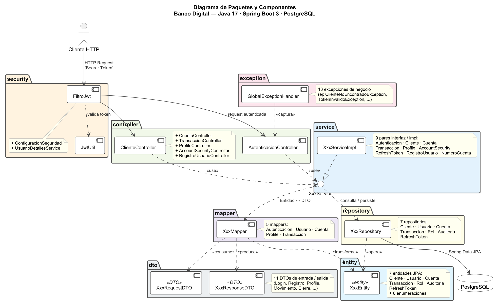

# Banco Digital

Backend REST de un sistema de banca digital que permite gestionar clientes, cuentas y transacciones con autenticacion basada en JWT.

**Equipo:** mista · mafe · bryan · xiomi · cristian  
**Documentacion completa:** [docs/index.md](docs/index.md)

---

[](https://github.com/OWNER/REPO/actions/workflows/ci.yml)
[](target/site/jacoco/index.html)

**Nota:** se añadieron tests y un workflow CI que ejecuta la suite de pruebas y publica los reportes de JaCoCo y Surefire como artefactos. El workflow no bloquea merges por ahora.

## Arquitectura



> Detalle completo en [docs/architecture.md](docs/architecture.md)

## Estructura del proyecto

```
banco-digital/
├── src/
│   ├── main/
│   │   ├── java/fe/banco_digital/
│   │   │   ├── controller/     # Endpoints REST
│   │   │   ├── dto/            # Objetos de entrada y salida de los endpoints
│   │   │   ├── entity/         # Clases que representan las tablas de la base de datos
│   │   │   ├── exception/      # Excepciones personalizadas y manejo global de errores
│   │   │   ├── mapper/         # Conversion entre entidades y DTOs
│   │   │   ├── repository/     # Consultas a la base de datos
│   │   │   ├── security/       # Configuracion JWT y filtros de seguridad
│   │   │   ├── service/        # Logica de negocio (interfaz + implementacion)
│   │   │   └── web/            # Clase principal de la aplicacion
│   │   └── resources/
│   │       └── application.properties   # Configuracion de Spring (DB, JPA, JWT)
│   └── test/                   # Tests de integracion
│
├── docs/                       # Documentacion del proyecto
│   ├── guides/                 # Guias practicas (inicio rapido, API, flujo Git)
│   ├── modules/                # Descripcion de cada modulo de negocio
│   ├── decisions/              # Decisiones de arquitectura (ADRs)
│   ├── diagrams/               # Diagramas de arquitectura, base de datos y autenticacion
│   └── arqui/                  # Entregables formales del sprint
│
├── .agents/                    # Contexto e instrucciones para Claude Code
├── scripts/                    # Scripts de utilidad
├── pom.xml                     # Dependencias y configuracion de Maven
└── scripts/run.sh              # Script para levantar la aplicacion
```

## QA y cobertura

- Ejecutar tests localmente:

```bash
./mvnw.cmd -DskipTests=false test
```

- Informes generados (local):
	- Surefire reports: `target/surefire-reports`
	- JaCoCo HTML: `target/site/jacoco/index.html` (CSV: `target/site/jacoco/jacoco.csv`)

- CI: se añadió `.github/workflows/ci.yml` que ejecuta `mvn verify` y sube los artefactos `jacoco-report` y `surefire-reports`.

## Cambios realizados

- Añadidos tests unitarios y de integración bajo `src/test/java` (cobertura y validación de handlers, seguridad y servicios).  
- Añadido workflow CI: `.github/workflows/ci.yml` (runs tests, publica artefactos).  

No se modificó lógica del backend; solo se añadieron tests y archivos de CI/reporting.

